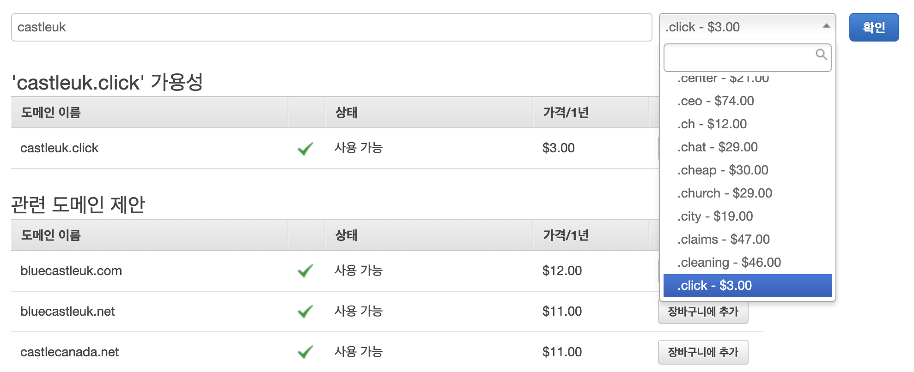

## 목차

직접 만든 EC2 서버를 배포하면서, 실시간 영상을 받아야 할 때가 있었습니다.  
근데 HTTP로는 인증서가 없어 웹캠을 받지 못하는 문제가 있었습니다.  
기존에 있던 방법들은 AWS의 UI 업데이트 이후 복잡함이 있었기에 이를 해결한 방법을 다시 정리합니다.  

본문은 해당 순서로 진행될 예정입니다.  

1. 도메인 등록  

## 도메인 등록

타 사이트에서 도메인을 구매하여 연결할 수도 있겠지만, 본문에서는 AWS 내에서 도메인 등록부터 시작하겠습니다.  

AWS의 Route 53 서비스에 들어간 뒤, **도메인 등록** 탭에 들어갑니다.  
여러가지 선택지가 있지만, .click 도메인이 3$로 가장 저렴해보였습니다.  

