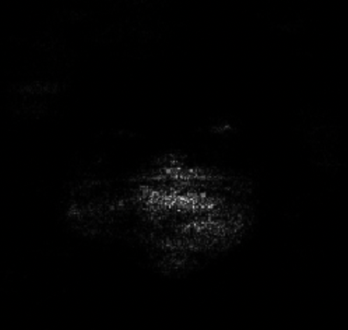
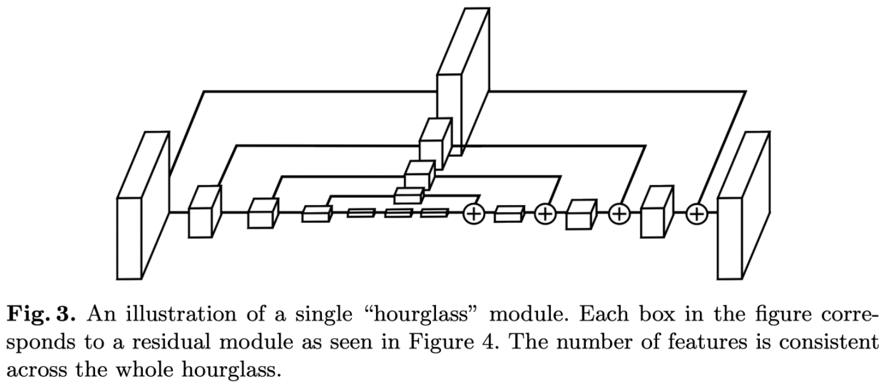
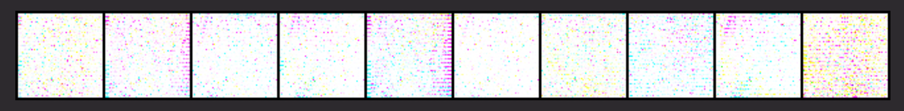
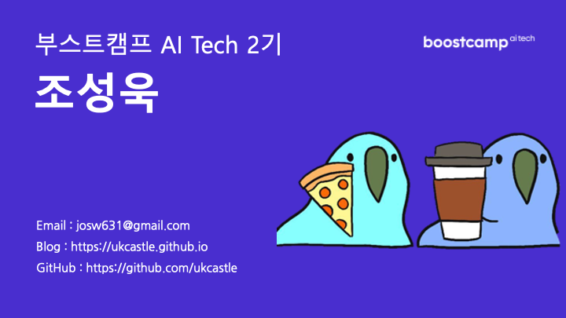

---
layout: post
title: Computer Vision
category: BC
tag: [Deep Learning]
---  

## 주간 정리 내용

[CNN Visualization](https://ukcastle.github.io/bc/2021/09/13/w7d1/)  
[Efficient Learning](https://ukcastle.github.io/bc/2021/09/14/w7d2/)  
[Conditional generative model](https://ukcastle.github.io/bc/2021/09/15/w7d3/)  
[Multi-modal Learning](https://ukcastle.github.io/bc/2021/09/16/w7d4/)  
[3D understanding](https://ukcastle.github.io/bc/2021/09/17/w7d5/)  

## 과제 수행 내용  

#### 선택과제 1  
[Grad-CAM](https://ukcastle.github.io/bc/2021/09/13/w7d1/#grad-cam)을 이용하여 모델이 어디에 집중하고 있는지 직접 실습해보는 코스였다. 이미지는 저작권때문에 올리지 못하고, 이 사진만은 저작권에 걸리지 않을것같아 올린다.  
  
어둠속에서 에일리언이 사냥감 잡으려고 숨어있는거 아니고 마스크를 쓰고 있는 평범한 사진에서 모델이 어떤 부분에 집중하는지 Grad-CAM을 이용하여 시각화 한 자료이다.  
마스크 부분에 집중하고 있다는 것을 알 수 있다. 다시한번 강조하지만 에일리언이 아니다.  

#### 선택과제 2  
Hourglass Network를 통하여 [Landmark Localization](https://ukcastle.github.io/bc/2021/09/14/w7d2/#landmark-localization)을 하는 내용으로, 이미지는 저작권 문제로 올리지 못한다.  
과제의 내용은 직접 Hourglass Module을 구현한 뒤 훈련시키는 내용이였다.  

##### Hourglass Module  

이렇게 생긴 놈이다.  

  

#### 필수과제 4  

Conditional GAN을 구현해보는 내용이었다.  
개인적으로 상당히 재밌게 했는데, GAN이라는 분야에 대한 흥미가 매우 높아졌던 계기가 될 것 같다.  

과제의 목적은 Quickdraw Dataset을 가지고 cGAN을 구현하는데, 솔직히 말하면 데이터의 질이... 매우 안좋아서 원하는 대로 생성해내지 못했다. 그래도 자기 자식은 이뻐보인다는듯이 
자랑 한번 하고가야겠다.  

  
다시한번 말하지만, 데이터가 잘못된거다  

#### 선택과제 3    

이미지를 Histogram으로 나누어 편집해보고, Alpha-blending
을 적용해보는 과제였다.  
원래도 사진 보정하는 것을 좋아하다보니 익숙한 단어들이 나와서 매우 반가운 과제였다.  

## 피어세션 정리  

Lv2 U스테이지 팀원들과 짧았다면 매우 짧은 2주간의 피어세션이 끝이 났다.  
팀원분들 덕분에 잘 몰랐던, 아니 몰랐는지도 몰랐던 부분에 대하여 다양한 시각으로 접근할 수 있어 매우 도움이 되었다. 특히 좋은 자료를 공유해주신 캠퍼님 덕분에 궁금했던 부분이 잘 채워졌다.    
[GAN에 대한 다양한 소개](https://velog.io/@tobigs-gm1/basicofgan)  
[GAN Loss란](https://velog.io/@hyebbly/Deep-Learning-Loss-정리-1-GAN-loss)  
 
또한 멘토링 시간에는 VGGNet, GoogLeNet, ResNet에 대한 구조에 대해서 깊게 파보고, Receptive field가 무엇인지에 대하여 상기시키고, 개념을 다시 잡고 가는 시간이었다.  

## 회고  

지난 2주는, 그 전 5주와는 다른 2주는, 개인적으로는 이렇게 정신없었던적이 있을까? 싶었던 2주였다.  
끝난줄만 알았던 졸업작품이, 갑자기 무슨 이유때문인지(할 말은 많지만... 제가 교수님들 흉을 어떻게 보겠어요~) 발표를 하러 오라고 했다. 그 당시 상황을 비유하자면 1년동안 무너지지 않고 쌓아왔던 도미노를 끝난 기념으로 와르르르르르 무너뜨렸는데, 갑자기 1주일뒤에 그 도미노에 흥미가 있는 사람이 생겨 다시 보여달라고 하는 상황이었다.  
왜 그렇게 비유했냐면, 2개의 서버중 하나에서 쓰이는 라이브러리가 지원이 중단되어 설치하고 환경 구축하는데 상당히 오래걸렸고 하나는 기존 하나의 이미지로 돌아가던 웹서버를 K8s 실습용으로 무려 5개의 노드로 나누어 구현한 상태였고 또다른 한 GPU 서버를 담당하던 팀원이 군복무 문제로 연락두절된 상태였고 결국 K8s + Docker환경에서 다시 정상구동시키기 위하여 진짜 별 짓을 다했다.  
또, Edge device에서도 약간의 문제점이 있었는데, 그 문제점까지 고치느라... 결국 지난 딱 1주일 전 금요일부터 지난 목요일까지 부캠 활동 10 to 7 / 졸작 다시 구현하기 7 to 2 / 수면 3 to 9 만을 반복했던 것 같다.  
솔직히 정상 컨디션에서 일주일정도 저정도 고통은 견딜만했는데 백신 2차접종 시기까지 겹쳤고, 몸이 약할때 무리해서인지 몸살까지 걸린상태로 타이레놀먹고 발표했었다. ㅜㅜ   
그래서 안그래도 짧은 2주간의 팀플레이가 더 짧게 느껴졌고, 개인적으로는 상당히 좋은 캠퍼분들이었는데 더 친해지지 못해서 아쉬운 2주였다. 매우 실력있는 캠퍼분들이었고 앞으로의 캠프 생활, 추후 캠프가 끝난 뒤에도 생각날 사람들일것이다.  
그럼 뭐 푸념은 이정도로 마치고... 추석때 제대로 복습하지 못한 강의들을 다시 봐야겠다.    

 

